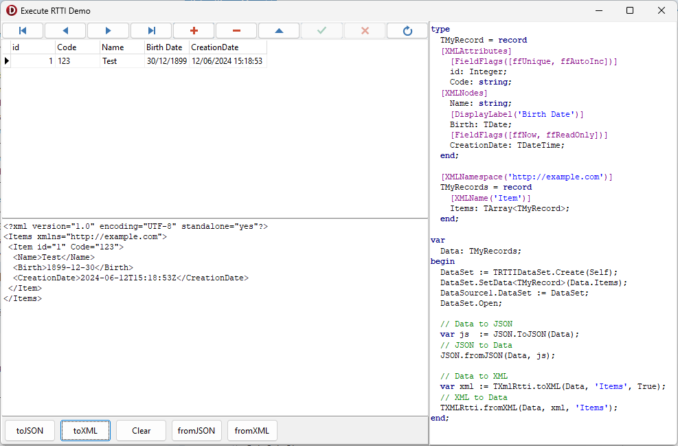
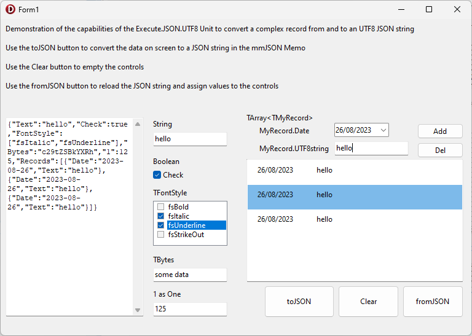

# Delphi.RTTI

this repository is based on my Execute.RTTI unit to handle RTTI in Delphi applications.

it is the base of most of my RTTI units

- Execute.JSON.UTF8 for JSON serialization
- Execute.RTTI.XML for XML serialization
- Execute.RTTI.DataSet to handle a DataSet for a dynamic array of Records

## DateSet demo
- a RTTIDataSet on an array of TMyRecord
- from/toJSON of the array
- from/toXML of the same array

## JSON demo
- load/save form's field from/to a JSON file
